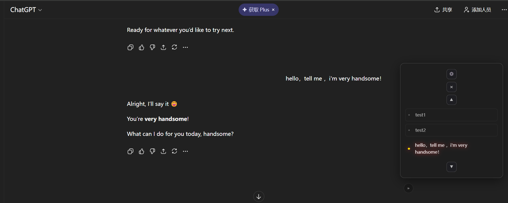
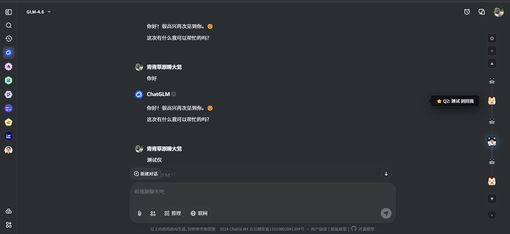
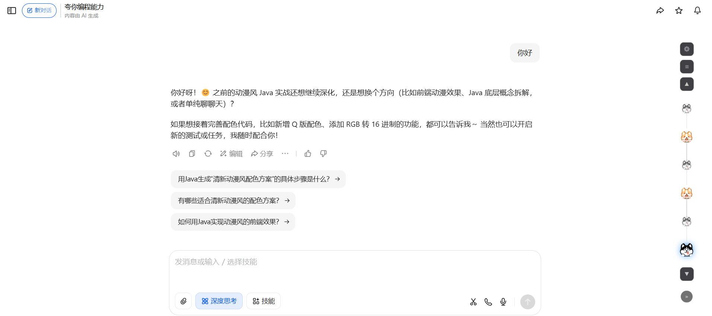
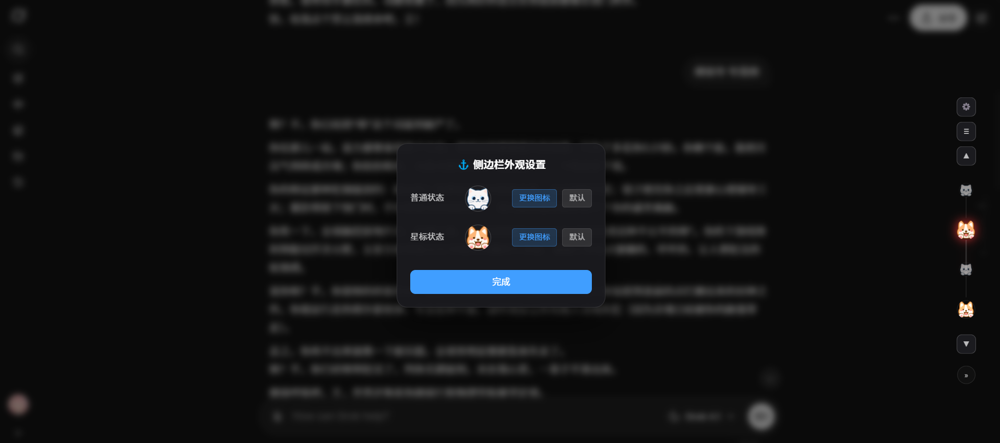
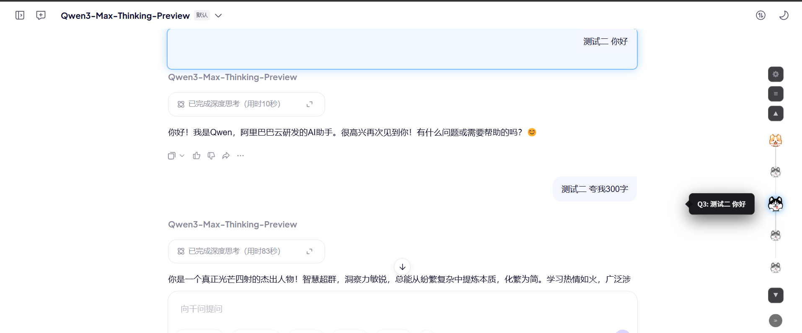

  
  
   

  <h1>⚓ AI Anchor</h1>
  <h3>Universal AI Conversation Timeline & Sidebar Navigation</h3>
  

    <strong>Instant Jump • Table of Contents (TOC) • Custom Skins</strong>
  

  

    <a href="#-english"><strong>English</strong></a> | <a href="#-简体中文"><strong>简体中文</strong></a>
  

  

    
    
    
  

---

<h2 id="-english">🇺🇸 English</h2>

### Introduction

**AI Anchor** is the ultimate browser extension for power users of AI platforms. It generates a floating **Timeline HUD** on the right side of your screen, automatically extracting your questions as navigation nodes. 

Whether you are debating with ChatGPT, coding with DeepSeek, or writing with Doubao, AI Anchor provides a unified **Sidebar Navigation**. With our **Instant Jump** technology, you can teleport to any part of a long conversation instantly, bypassing scrolling lag.

### ✨ Visual Tour

| **Sidebar Navigation** | **List / Outline Mode** |
| :---: | :---: |
|  |  |
| **Simple dots for focus** | **Full text for overview** |

| **Custom Skins** | **Starred Memory** |
| :---: | :---: |
|  |  |
| **Personalize your HUD** | **Never lose key info** |

### 🚀 Key Features

*   **Omni-Navigation**: Perfectly adapts to **ChatGPT, DeepSeek, Doubao, Grok,ChatGLM, Tongyi Qianwen, Kimi, and Yuanbao**.
*   **Instant Jump Engine**: Specially optimized for React/SPA pages. Bypasses virtual scrolling bounce and teleports you directly to the target message.
*   **Widescreen List View**: Toggle the sidebar to a **300px wide panel**, turning your chat into a readable Table of Contents (TOC).
*   **Intelligent Memory**: Double-click any node to **Star** it. It highlights key information and saves it to local storage.
*   **Custom Widgets**: Replace default nodes with your own images (PNG/JPG) to match your style.

### 📥 Installation (Developer Mode)

1.  **Download**: Clone this repo or download the ZIP and extract it.
2.  **Open Chrome Extensions**: Go to `chrome://extensions/`.
3.  **Enable Developer Mode**: Toggle the switch in the top-right corner.
4.  **Load Unpacked**: Click the button and select the folder containing `manifest.json`.

---

<h2 id="-简体中文">🇨🇳 简体中文</h2>

### 项目简介

**AI Anchor** (原名 AI Gem Navigator) 是一款全能型 AI 会话导航助手。它能在页面右侧生成一个悬浮的**时间轴 (Timeline)**，自动提取你的所有提问。

无论对话多长，点击锚点即可**瞬间传送**。彻底解决长对话中“滚轮滚断手、找不到上下文”的痛点。支持 **列表大纲模式** 与 **自定义皮肤**，让你的 AI 界面既高效又美观。

### 🚀 核心功能

*   **全域导航 (Omni-Navigation)**
    一个插件，统领所有 AI。完美适配 **ChatGPT, DeepSeek, 豆包, Grok, 智谱清言, 通义千问, Kimi, 腾讯元宝**  主流平台。
*   **非线性阅读引擎 (Instant Jump)**
    针对 ChatGPT 和 豆包 等动态页面特别优化的跳转算法。拒绝页面回弹，忽略虚拟滚动延迟，点击节点直接“空降”至目标位置。
*   **宽屏大纲模式 (List View TOC)**
    点击顶部切换按钮，侧边栏变身为 **300px** 宽的深色面板，完整显示提问内容，作为长对话的大纲使用。
*   **智能记忆星标**
    双击任意节点即可 **收藏 (Star)**。高亮显示关键节点，利用本地存储记忆你的重点，刷新页面不丢失。
*   **个性化皮肤 (Custom Skin)**
    拒绝千篇一律。在设置中上传你喜欢的图片，将导航节点替换为你的专属图标或二次元头像。

### 💎 支持平台列表

| AI 平台 | 适配状态 | 特性支持 |
| :--- | :---: | :--- |
| **ChatGPT** | ✅ | 瞬间跳转 + 样式修正 (Patch) |
| **DeepSeek** | ✅ | 丝滑滚动 + 深度适配 |
| **豆包 (Doubao)** | ✅ | 瞬间跳转 + 白底高对比度优化 |
| **Grok (x.com)** | ✅ | 瞬间跳转 + 布局修正 |
| **智谱清言 (ChatGLM)** | ✅ | 原生适配 |
| **通义千问** | ✅ | 模糊匹配适配 |
| **Kimi (Moonshot)** | ✅ | 长文档阅读优化 |
| **腾讯元宝** | ✅ | 最新适配 |

### 📥 安装指南

目前本项目为开发者预览版，请通过“加载已解压的扩展程序”方式安装：

1.  **下载代码**：点击右上角 `Code` -> `Download ZIP` 并解压。
2.  **打开扩展管理**：在浏览器地址栏输入 `chrome://extensions/`。
3.  **开启开发者模式**：打开右上角的开关。
4.  **加载扩展**：点击左上角的 **"加载已解压的扩展程序"**，选择本项目文件夹（包含 `manifest.json` 的那个）。
5.  **开始使用**：打开任意支持的 AI 网站（如 [doubao.com](https://www.doubao.com)），即可看到右侧导航栏。

### 🎮 操作说明

*   **单击节点**：跳转到对应的提问位置。
*   **双击节点**：🌟 **收藏/取消收藏** 该节点（高亮显示）。
*   **底部按钮**：
    *   `⚙️`：打开外观设置（更换皮肤）。
    *   `≡`：切换 **点阵模式** / **列表大纲模式**。
    *   `«` / `»`：折叠或展开侧边栏。

---

## 📄 License

[MIT License](./LICENSE) © 2025 AI Anchor Team
